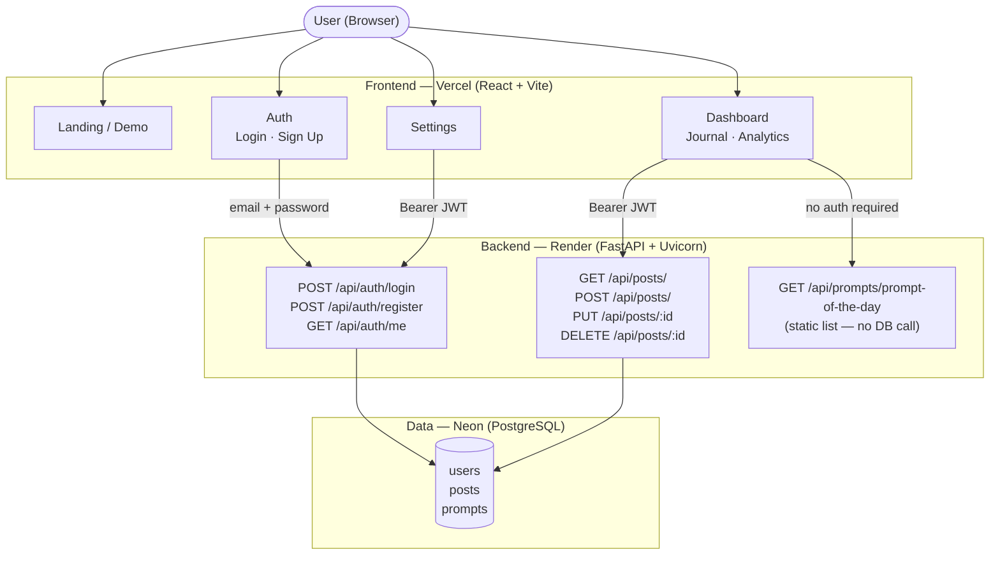
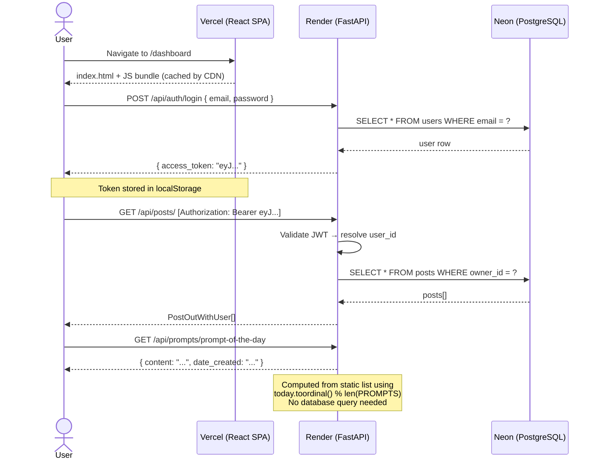
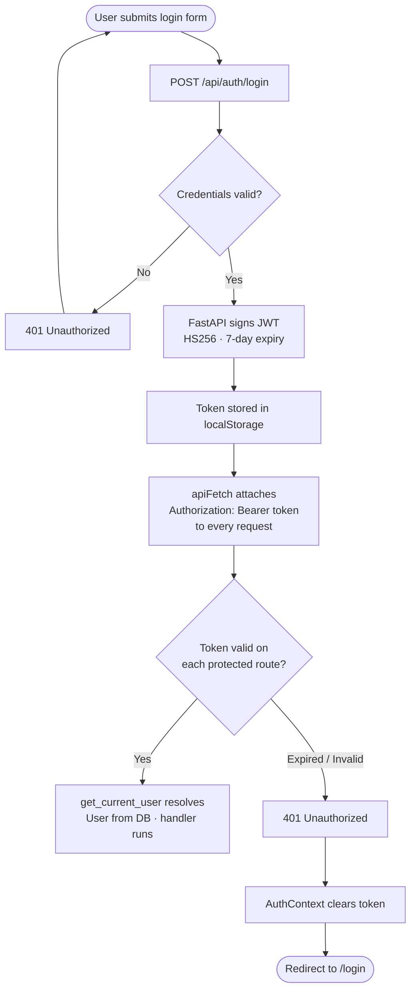
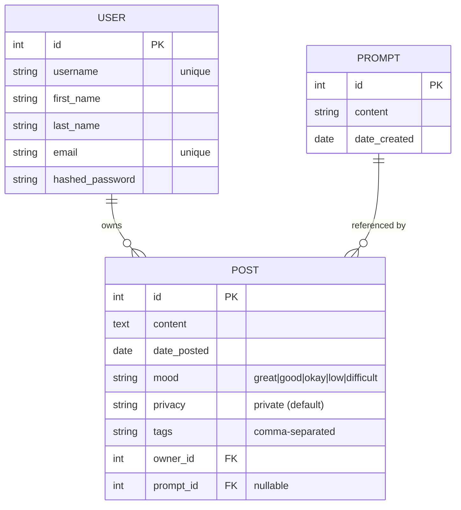

# Luma — Architecture

## System Overview

```mermaid
graph TD
    User(["User (Browser)"])

    subgraph Vercel ["Frontend — Vercel (React + Vite)"]
        direction TB
        Landing["Landing / Demo"]
        Auth["Auth\nLogin · Sign Up"]
        Dashboard["Dashboard\nJournal · Analytics"]
        Settings["Settings"]
    end

    subgraph Render ["Backend — Render (FastAPI + Uvicorn)"]
        direction TB
        AuthAPI["POST /api/auth/login\nPOST /api/auth/register\nGET  /api/auth/me"]
        PostsAPI["GET    /api/posts/\nPOST   /api/posts/\nPUT    /api/posts/:id\nDELETE /api/posts/:id"]
        PromptsAPI["GET /api/prompts/prompt-of-the-day\n(static list — no DB call)"]
    end

    subgraph Neon ["Data — Neon (PostgreSQL)"]
        DB[("users\nposts\nprompts")]
    end

    User --> Landing
    User --> Auth
    User --> Dashboard
    User --> Settings

    Auth      -- "email + password" --> AuthAPI
    Dashboard -- "Bearer JWT"        --> PostsAPI
    Dashboard -- "no auth required"  --> PromptsAPI
    Settings  -- "Bearer JWT"        --> AuthAPI

    AuthAPI   --> DB
    PostsAPI  --> DB
```

---

## Request / Response Flow

```mermaid
sequenceDiagram
    actor U as User
    participant FE as Vercel (React SPA)
    participant BE as Render (FastAPI)
    participant DB as Neon (PostgreSQL)

    U->>FE: Navigate to /dashboard
    FE-->>U: index.html + JS bundle (cached by CDN)

    U->>BE: POST /api/auth/login { email, password }
    BE->>DB: SELECT * FROM users WHERE email = ?
    DB-->>BE: user row
    BE-->>U: { access_token: "eyJ..." }

    Note over U,FE: Token stored in localStorage

    U->>BE: GET /api/posts/  [Authorization: Bearer eyJ...]
    BE->>BE: Validate JWT → resolve user_id
    BE->>DB: SELECT * FROM posts WHERE owner_id = ?
    DB-->>BE: posts[]
    BE-->>U: PostOutWithUser[]

    U->>BE: GET /api/prompts/prompt-of-the-day
    BE-->>U: { content: "...", date_created: "..." }
    Note over BE: Computed from static list using<br/>today.toordinal() % len(PROMPTS)<br/>No database query needed
```

---

## Authentication Flow

```mermaid
flowchart TD
    A([User submits login form]) --> B[POST /api/auth/login]
    B --> C{Credentials valid?}
    C -- No --> D[401 Unauthorized]
    D --> A
    C -- Yes --> E[FastAPI signs JWT\nHS256 · 7-day expiry]
    E --> F[Token stored in localStorage]
    F --> G[apiFetch attaches\nAuthorization: Bearer token\nto every request]
    G --> H{Token valid on\neach protected route?}
    H -- Yes --> I[get_current_user resolves\nUser from DB · handler runs]
    H -- Expired / Invalid --> J[401 Unauthorized]
    J --> K[AuthContext clears token]
    K --> L([Redirect to /login])
```

---

## Data Model

```mermaid
erDiagram
    USER {
        int     id             PK
        string  username       "unique"
        string  first_name
        string  last_name
        string  email          "unique"
        string  hashed_password
    }

    POST {
        int     id             PK
        text    content
        date    date_posted
        string  mood           "great|good|okay|low|difficult"
        string  privacy        "private (default)"
        string  tags           "comma-separated"
        int     owner_id       FK
        int     prompt_id      FK "nullable"
    }

    PROMPT {
        int     id             PK
        string  content
        date    date_created
    }

    USER   ||--o{ POST   : "owns"
    PROMPT ||--o{ POST   : "referenced by"
```
