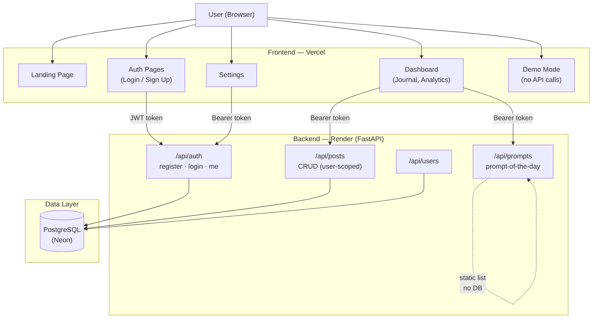
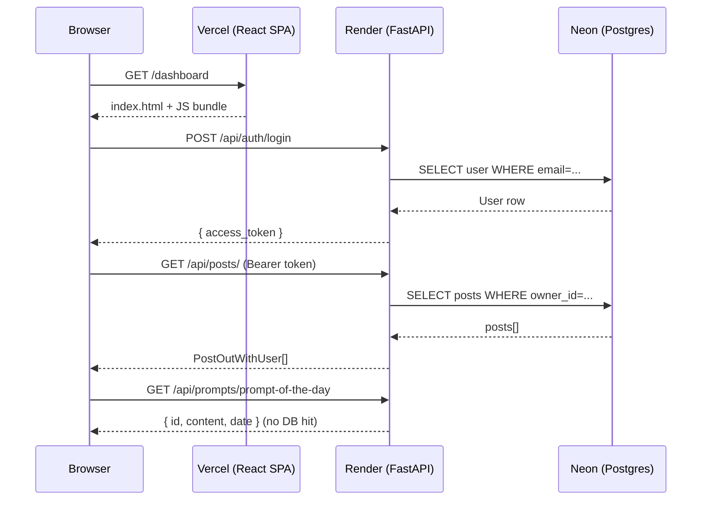
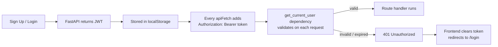
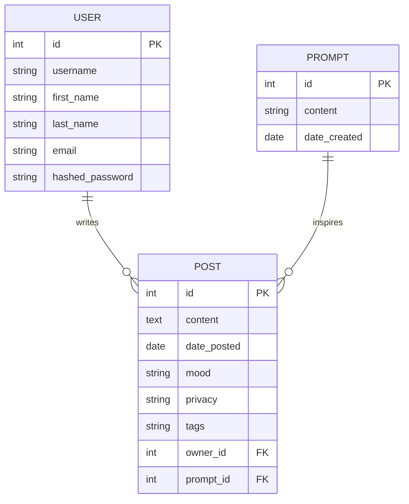

# Luma — Architecture

## System Overview

```mermaid
graph TD
    User["User (Browser)"]

    subgraph Frontend ["Frontend — Vercel"]
        Landing["Landing Page"]
        Auth["Auth Pages\n(Login / Sign Up)"]
        Dashboard["Dashboard\n(Journal, Analytics)"]
        Settings["Settings"]
        Demo["Demo Mode\n(no API calls)"]
    end

    subgraph Backend ["Backend — Render (FastAPI)"]
        AuthRouter["/api/auth\nregister · login · me"]
        PostsRouter["/api/posts\nCRUD (user-scoped)"]
        PromptsRouter["/api/prompts\nprompt-of-the-day"]
        UsersRouter["/api/users"]
    end

    subgraph Data ["Data Layer"]
        DB[("PostgreSQL\n(Neon)")]
    end

    User --> Landing
    User --> Auth
    User --> Dashboard
    User --> Settings
    User --> Demo

    Auth -->|JWT token| AuthRouter
    Dashboard -->|Bearer token| PostsRouter
    Dashboard -->|Bearer token| PromptsRouter
    Settings -->|Bearer token| AuthRouter

    AuthRouter --> DB
    PostsRouter --> DB
    UsersRouter --> DB
    PromptsRouter -.->|static list\nno DB| PromptsRouter
```

## Request Flow

```mermaid
sequenceDiagram
    participant B as Browser
    participant V as Vercel (React SPA)
    participant R as Render (FastAPI)
    participant DB as Neon (Postgres)

    B->>V: GET /dashboard
    V-->>B: index.html + JS bundle

    B->>R: POST /api/auth/login
    R->>DB: SELECT user WHERE email=...
    DB-->>R: User row
    R-->>B: { access_token }

    B->>R: GET /api/posts/ (Bearer token)
    R->>DB: SELECT posts WHERE owner_id=...
    DB-->>R: posts[]
    R-->>B: PostOutWithUser[]

    B->>R: GET /api/prompts/prompt-of-the-day
    R-->>B: { id, content, date } (no DB hit)
```

## Authentication Flow

```mermaid
flowchart LR
    A[Sign Up / Login] --> B[FastAPI returns JWT]
    B --> C[Stored in localStorage]
    C --> D[Every apiFetch adds\nAuthorization: Bearer token]
    D --> E[get_current_user dependency\nvalidates on each request]
    E -->|valid| F[Route handler runs]
    E -->|invalid / expired| G[401 Unauthorized]
    G --> H[Frontend clears token\nredirects to /login]
```

## Data Model

```mermaid
erDiagram
    USER {
        int id PK
        string username
        string first_name
        string last_name
        string email
        string hashed_password
    }

    POST {
        int id PK
        text content
        date date_posted
        string mood
        string privacy
        string tags
        int owner_id FK
        int prompt_id FK
    }

    PROMPT {
        int id PK
        string content
        date date_created
    }

    USER ||--o{ POST : "writes"
    PROMPT ||--o{ POST : "inspires"
```
